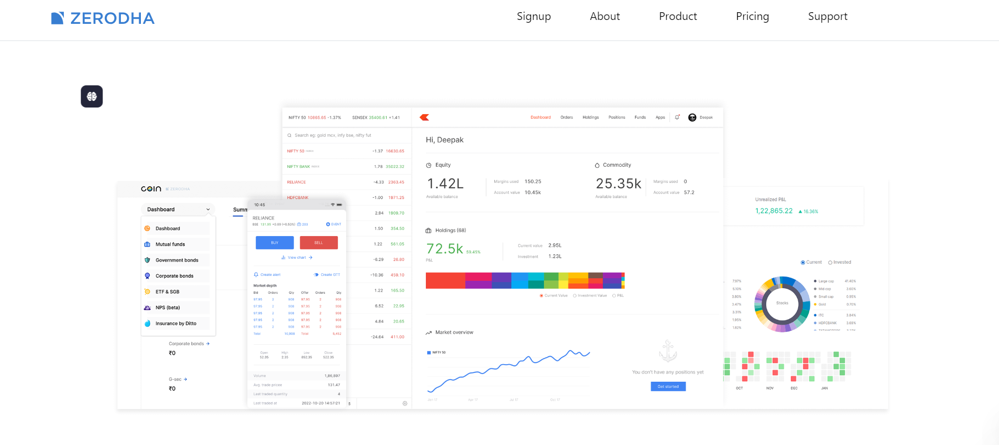

# Zerodha Clone

A simple stock trading platform clone inspired by **Zerodha**. This application allows users to:
- Trade stocks
- View market data in real-time
- Manage portfolios
- Execute buy and sell orders
- View transaction history

This project is built with **React.js** for the frontend, **Node.js** with **Express** for the backend, and **MongoDB** for database management.

## Demo



## Features

- **Real-time Market Data**: Fetches live stock data using APIs.
- **Trading Panel**: Allows users to buy and sell stocks.
- **Portfolio Management**: Users can view their stock holdings and transaction history.
- **User Authentication**: Secure sign-up, login, and session management.
- **Responsive UI**: Mobile-friendly design for easy access to the platform on any device.

## Technologies Used

### Frontend:
- **React.js**: JavaScript library for building the user interface.
- **React Router**: For handling client-side routing.
- **Axios**: For making HTTP requests to the backend.
- **Chart.js / Recharts**: For displaying stock charts and trends.

### Backend:
- **Node.js & Express**: Backend API to handle requests such as placing trades, fetching market data, etc.
- **MongoDB**: NoSQL database to store user data, transaction history, and portfolio.
- **JWT Authentication**: Secure login and registration process.

### APIs:
- **Alpha Vantage API**: Provides stock market data (free tier available).
- **Custom Stock Data API**: If you need more customized data integration.

## Installation

### 1. Clone the repository:
```bash
git clone https://github.com/yourusername/zerodha-clone.git
